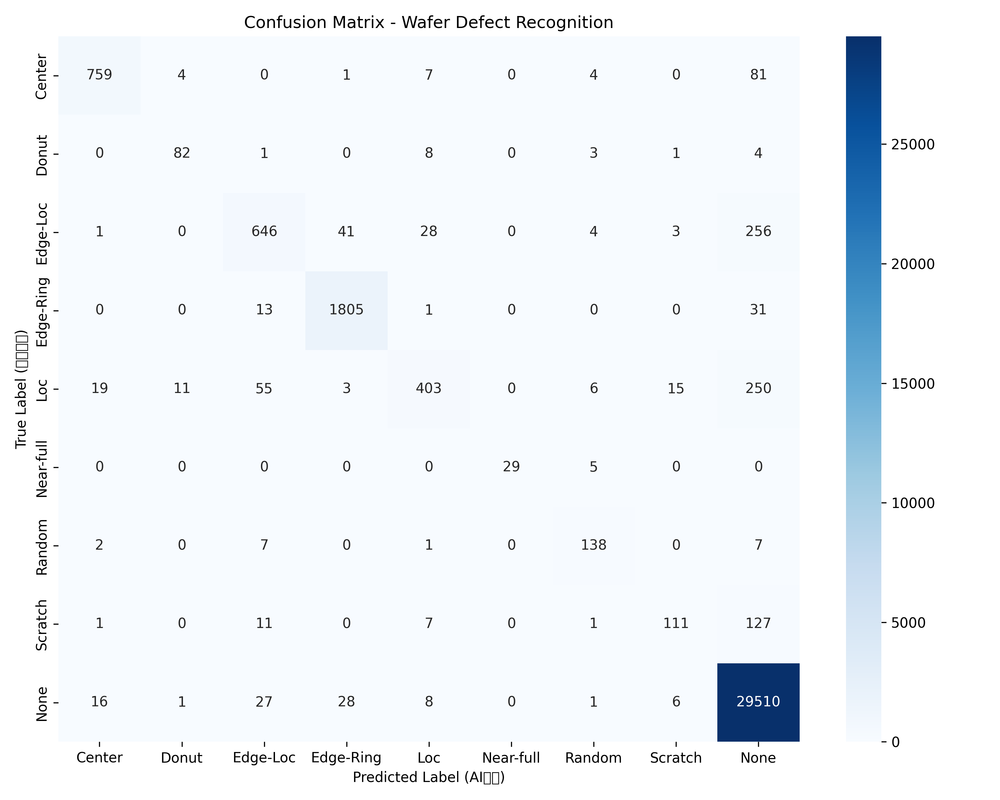
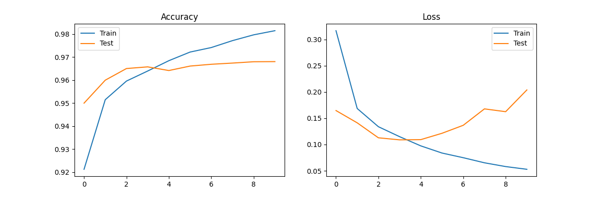

```markdown
# Wafer Map Defect Pattern Recognition based on CNN

## 📌 Project Overview
In semiconductor manufacturing, **Yield Management Systems (YMS)** rely heavily on the timely detection of defect patterns on wafer maps. These spatial patterns (e.g., *Donut*, *Scratch*, *Edge-Ring*) often reveal specific process failures in lithography, etching, or CMP steps.

This project implements a **Convolutional Neural Network (CNN)** to automate the classification of **9 types of wafer defect patterns** using the real-world **WM-811K dataset**.

**🎯 Key Achievement:**
- Achieved **96.8% Validation Accuracy** on the test set.
- Developed a robust preprocessing pipeline to handle variable wafer sizes and class imbalance.

---

## 📊 Results & Analysis

### 1. Model Performance
- **Validation Accuracy:** 96.80%
- **Training Accuracy:** 98.14%
- **Observation:** The model shows high sensitivity to geometric patterns like *Donut* and *Center*, but faces challenges with *Scratch* defects due to severe class imbalance in the raw data.

### 2. Visualization
#### Confusion Matrix
*(Visualizes the classification performance across 9 categories)*


#### Training History
*(Loss & Accuracy curves showing model convergence)*


---

## 🛠 Tech Stack
- **Core:** Python 3.11, TensorFlow 2.x (Keras)
- **Data Processing:** NumPy, Pandas, Pillow (PIL)
- **Visualization:** Matplotlib, Seaborn
- **Environment:** VS Code (Virtualenv)

---

## 📂 Project Structure
```text
├── LSWMD.pkl              # Raw Dataset (Need to download separately)
├── processed_data.npz     # Preprocessed binary data (Generated by Step 2)
├── wafer_model.h5         # Trained CNN Model (Generated by Step 3)
├── requirements.txt       # Python dependencies
├── step1_load_data.py     # Data Loading & Visualization
├── step2_preprocess.py    # Data Cleaning, Resizing & One-hot Encoding
├── step3_train.py         # CNN Architecture & Training
└── step4_evaluate.py      # Model Evaluation & Plotting

```

---

## 🚀 How to Run

### Prerequisite

Ensure you have **Python 3.11** installed.

### 1. Clone the Repository

```bash
git clone [https://github.com/YOUR_USERNAME/Wafer-Map-Defect-Recognition.git](https://github.com/YOUR_USERNAME/Wafer-Map-Defect-Recognition.git)
cd Wafer-Map-Defect-Recognition

```

### 2. Setup Environment

It is recommended to use a virtual environment:

```bash
python3.11 -m venv venv
source venv/bin/activate
pip install -r requirements.txt

```

### 3. Prepare Data

Due to GitHub file size limits, the raw dataset is not included.

* **Download** the `LSWMD.pkl` file (WM-811K Dataset) from Kaggle or other sources.
* **Place** it in the root directory of this project.

### 4. Execute Pipeline

Run the scripts in the following order:

**Step 1: Sanity Check** (Visualize a sample wafer)

```bash
python step1_load_data.py

```

**Step 2: Preprocessing** (Resize to 64x64 & Normalize)

```bash
python step2_preprocess.py

```

*Output: `processed_data.npz*`

**Step 3: Training** (Train the CNN model)

```bash
python step3_train.py

```

*Output: `wafer_model.h5`, `training_history.png*`

**Step 4: Evaluation** (Generate Confusion Matrix)

```bash
python step4_evaluate.py

```

*Output: `confusion_matrix.png`, Classification Report*

---

## 📝 Future Work

* Implement **Data Augmentation** (Rotation/Flipping) to improve *Scratch* detection.
* Experiment with **Transfer Learning** (ResNet/VGG) for potentially higher accuracy.
* Deploy the model as a simple Web API using **Flask/FastAPI**.

---

*Author: LIU Ming Xuan*

```

```